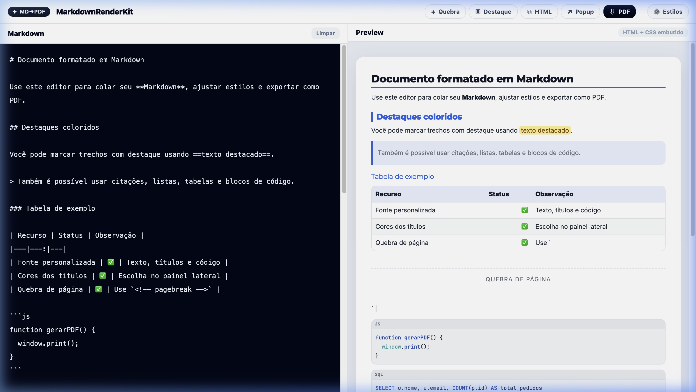
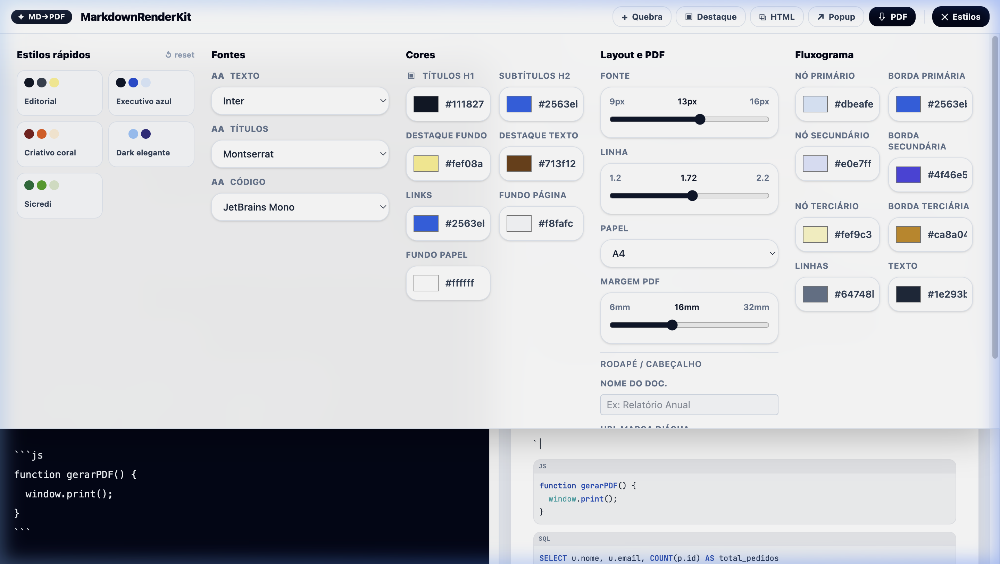
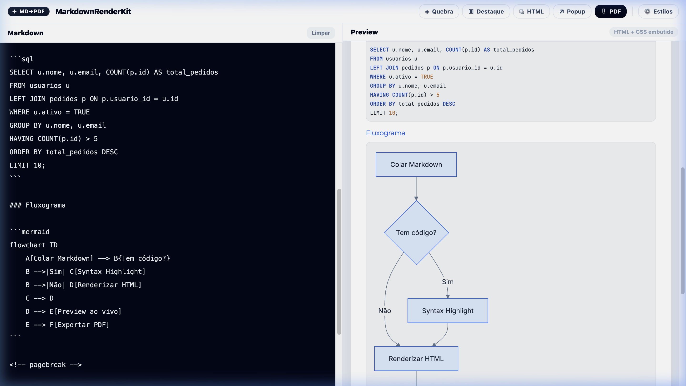
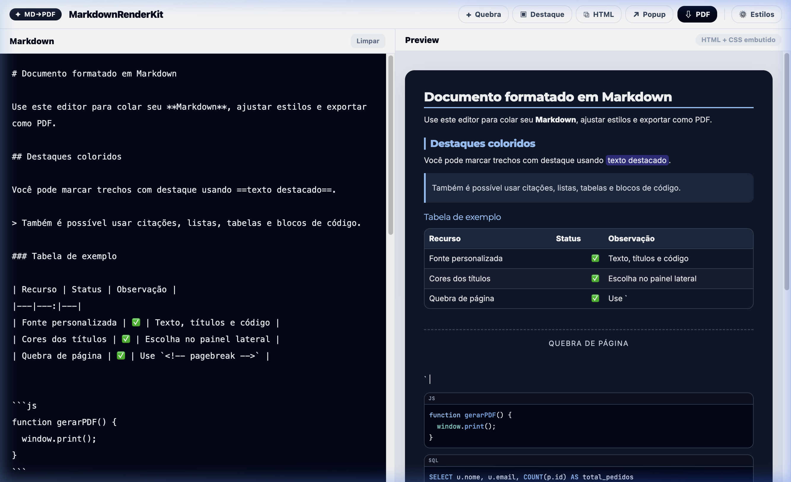
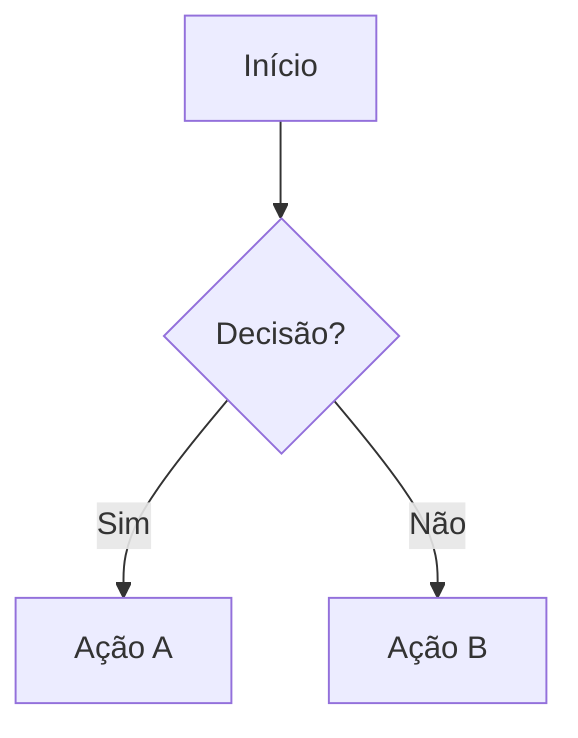

# MarkdownRenderKit

> Editor Markdown avançado com preview ao vivo, syntax highlighting, diagramas Mermaid e exportação para PDF — tudo no navegador.



---

## ✨ Funcionalidades

- **Editor side-by-side** — escreva Markdown à esquerda e veja o resultado formatado à direita, em tempo real
- **Syntax Highlighting** — colorização automática de blocos de código (JavaScript, SQL, Python, e 180+ linguagens via Highlight.js)
- **Diagramas Mermaid** — renderização nativa de flowcharts, sequence diagrams, gantt charts e mais
- **Exportação para PDF** — gera PDFs com layout profissional, respeitando quebras de página, cabeçalhos, rodapés e marca d'água
- **Copiar HTML** — copie o documento completo (HTML + CSS embutido) para colar em e-mails, Notion, Confluence, etc.
- **Preview em Popup** — abra uma janela separada com o documento formatado
- **Temas e presets** — 5 temas prontos (Editorial, Executivo Azul, Criativo Coral, Dark Elegante, Sicredi) com troca instantânea
- **Customização total** — controle granular sobre fontes, cores, tamanhos, espaçamento e layout do PDF
- **Destaques coloridos** — use `==texto==` para realçar trechos com cor de destaque configurável
- **Quebras de página** — insira `<!-- pagebreak -->` para controlar a paginação no PDF
- **Persistência local** — todas as configurações são salvas automaticamente no `localStorage`

---

## 📸 Screenshots

### Editor & Preview ao vivo

Layout dividido 50/50 com editor escuro e preview formatado:


### Painel de Configurações

Controle total sobre fontes, cores, layout, tamanho de papel e cores de fluxogramas:



### Diagramas Mermaid & Syntax Highlighting

Renderização de flowcharts com cores customizáveis e blocos de código com colorização:



### Tema Dark Elegante

Modo escuro integrado para documentos com visual sofisticado:



---

## 🚀 Início Rápido

### Pré-requisitos

- [Node.js](https://nodejs.org/) v20.19+ ou v22.12+
- npm (incluído com o Node.js)

### Instalação

```bash
# Clone o repositório
git clone https://github.com/seu-usuario/markdown-render-kit.git
cd markdown-render-kit

# Instale as dependências
npm install

# Inicie o servidor de desenvolvimento
npm run dev
```

O app estará disponível em `http://localhost:5173/`.

### Build para produção

```bash
npm run build
```

Os arquivos otimizados serão gerados na pasta `dist/`.

---

## 🎨 Temas Disponíveis

| Tema | Descrição |
|------|-----------|
| **Editorial** | Tons neutros e elegantes, ideal para documentos formais |
| **Executivo Azul** | Paleta corporativa em azul, perfeito para relatórios |
| **Criativo Coral** | Tons quentes em coral e laranja, para apresentações criativas |
| **Dark Elegante** | Modo escuro sofisticado com acentos em azul claro |
| **Sicredi** | Paleta institucional verde, alinhada à identidade Sicredi |

---

## 🛠️ Customização

### Fontes

O app suporta 10 fontes para texto e títulos, e 4 fontes monospace para código:

**Texto/Títulos:** Inter, Roboto, Lato, Montserrat, Merriweather, Lora, Playfair Display, Georgia, Arial, Courier New

**Código:** JetBrains Mono, Fira Code, SF Mono, Courier New

### Cores

Todas as cores são ajustáveis individualmente:

- Títulos H1 e H2
- Fundo de destaque e texto de destaque
- Links
- Fundo da página e do papel
- Cores dos nós e bordas de fluxogramas (primário, secundário, terciário)

### Layout e PDF

- **Tamanho da fonte:** 9px a 16px
- **Altura da linha:** 1.2 a 2.2
- **Tamanho do papel:** A4, Letter, Legal, A3
- **Margem de impressão:** 6mm a 32mm
- **Nome do documento** no rodapé
- **Marca d'água** via URL de imagem

---

## 📝 Sintaxe Especial

### Destaque de texto

```markdown
Texto normal ==texto destacado== continuação.
```

### Quebra de página

```markdown
<!-- pagebreak -->
```

Alternativas aceitas:
```markdown
---page---
:::pagebreak
```

### Diagramas Mermaid

````markdown

````

---

## 🏗️ Tecnologias

| Tecnologia | Uso |
|---|---|
| [React 19](https://react.dev/) | Interface e componentes |
| [Vite 8](https://vitejs.dev/) | Bundler e dev server |
| [Marked](https://marked.js.org/) | Parser de Markdown |
| [Highlight.js](https://highlightjs.org/) | Syntax highlighting |
| [Mermaid](https://mermaid.js.org/) | Diagramas e flowcharts |
| [DOMPurify](https://github.com/cure53/DOMPurify) | Sanitização de HTML |
| [TailwindCSS 4](https://tailwindcss.com/) | Estilização da UI |

---

## 📂 Estrutura do Projeto

Organizado em **Clean Architecture** com separação clara de responsabilidades:

```
markdown-render-kit/
├── docs/                              # Screenshots para documentação
├── src/
│   ├── main.jsx                       # Entry point React
│   │
│   ├── domain/                        # Regras de negócio puras (sem dependências externas)
│   │   ├── entities/
│   │   │   └── settings.js            # defaultSettings, fontOptions, codeFontOptions
│   │   ├── valueObjects/
│   │   │   └── presets.js             # 5 temas prontos (Editorial, Sicredi, etc.)
│   │   └── starterMarkdown.js         # Conteúdo inicial do editor
│   │
│   ├── application/                   # Casos de uso e lógica de negócio
│   │   ├── markdownProcessor.js       # Parse, preprocess e render do Markdown
│   │   ├── cssBuilder.js              # Geração de CSS dinâmico, cores e syntax theme
│   │   ├── mermaidService.js          # Configuração de tema para diagramas Mermaid
│   │   ├── htmlExporter.js            # Geração do HTML completo para PDF/popup
│   │   └── selfTests.js              # Autotestes executados na inicialização
│   │
│   ├── infrastructure/                # Adaptadores para APIs externas
│   │   ├── settingsRepository.js      # Persistência via localStorage
│   │   └── clipboardService.js        # Cópia para área de transferência
│   │
│   └── presentation/                  # Camada de UI (único lugar com JSX/React)
│       ├── App.jsx                    # Componente raiz (orquestrador)
│       ├── index.css                  # Estilos globais (Tailwind)
│       ├── hooks/
│       │   └── useMarkdownEditor.js   # Todo o estado e handlers do editor
│       └── components/
│           ├── Icon.jsx
│           ├── Field.jsx
│           ├── Select.jsx
│           ├── ColorInput.jsx
│           ├── Slider.jsx
│           ├── Header.jsx             # Barra superior com botões de ação
│           ├── SettingsPanel.jsx      # Painel de configurações colapsável
│           ├── EditorPane.jsx         # Textarea do Markdown
│           └── PreviewPane.jsx        # Preview HTML renderizado
│
├── index.html                         # HTML base
├── vite.config.js                     # Configuração do Vite
├── tailwind.config.js                 # Configuração do Tailwind
├── postcss.config.js                  # Configuração do PostCSS
├── package.json
└── README.md
```

---

## 📄 Licença

ISC

---

<p align="center">
  Feito com ✦ por <strong>MarkdownRenderKit</strong>
</p>
